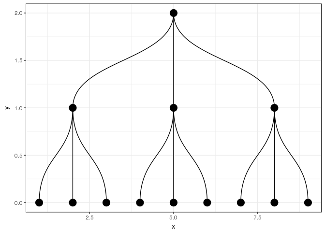

<!-- README.md is generated from README.Rmd. Please edit that file -->
orgsurveyr
==========

The goal of `orgsurveyr` is to facilitate the use of [Thomas Lin Pedersen's](https://www.data-imaginist.com) excellent [`tidygraph`](https://github.com/thomasp85/tidyraph) and [`ggraph`](https://github.com/thomasp85/ggraph) packages with organisational information used by many Human Resources departments, in particular employee surveys.

Installation
------------

You can install orgsurveyr from github with:

``` r
# install.packages("devtools")
devtools::install_github("ukgovdatascience/orgsurveyr")
```

Example
-------

An organisation is a very basic type of network known as a tree. The [`tidygraph`](https://github.com/thomasp85/tidyraph) package lets us simulate and represent a tree structure as follows:

``` r
tg <- tidygraph::create_tree(13,3) 
tg
#> # A tbl_graph: 13 nodes and 12 edges
#> #
#> # A rooted tree
#> #
#> # Node Data: 13 x 0 (active)
#> #
#> # Edge Data: 12 x 2
#>    from    to
#>   <int> <int>
#> 1     1     2
#> 2     1     3
#> 3     1     4
#> # ... with 9 more rows
```

The [`ggraph`](https://github.com/thomasp85/ggraph) package can be used to plot networks with the familiar [`ggplot2`](http://ggplot2.tidyverse.org) syntax. Below the simulated organisation is plotted as a dendrogram:

``` r
  ggraph(tg, 'dendrogram') + geom_edge_diagonal() + 
  geom_node_point(size=5) + theme_bw()
```



The `orgsurveyr` package provides detailed vignettes, convenience functions and example data to help HR analysts make use of the [`ggraph`](https://github.com/thomasp85/ggraph) and [`tidygraph`](https://github.com/thomasp85/tidyraph) packages in the analysis of organisation data.

Further reading/viewing
=======================

-   [Data Imaginist](https://www.data-imaginist.com) - Thomas Lin Pedersen's blog
-   ['Tidying up your network analysis with tidygraph and ggraph'](https://www.rstudio.com/resources/videos/tidying-up-your-network-analysis-with-tidygraph-and-ggraph/): RStudio::conf presentation from Thomas Lin Pedersen
-   [useR 2018 Interview with Thomas Lin Pedersen](https://user2018.r-project.org/blog/2018/04/18/interview-with-thomas-lin-pedersen/)
