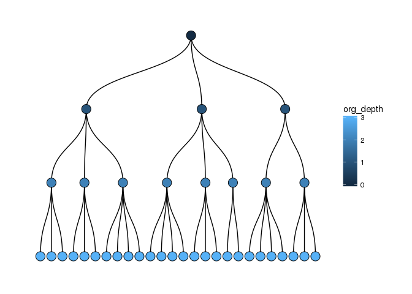

[](https://travis-ci.org/ukgovdatascience/orgsurveyr)
[](https://codecov.io/gh/ukgovdatascience/orgsurveyr)

<!-- README.md is generated from README.Rmd. Please edit that file -->

# orgsurveyr

The goal of `orgsurveyr` is to facilitate the use of [Thomas Lin
Pedersen’s](https://www.data-imaginist.com) excellent
[`tidygraph`](https://github.com/thomasp85/tidygraph) and
[`ggraph`](https://github.com/thomasp85/ggraph) packages with
organisational information used by many Human Resources departments, in
particular employee surveys.

## Installation

You can install orgsurveyr from github with:

``` r
# install.packages("devtools")
devtools::install_github("ukgovdatascience/orgsurveyr", build_vignettes = TRUE)
```

## Example - ggraph/tidygraph

An organisation is a very basic type of network known as a tree. The
[`tidygraph`](https://github.com/thomasp85/tidygraph) package lets us
simulate and represent a tree structure as follows:

``` r
tg <- tidygraph::create_tree(13,3) 
tg
#> # A tbl_graph: 13 nodes and 12 edges
#> #
#> # A rooted tree
#> #
#> # Node Data: 13 x 0 (active)
#> #
#> # Edge Data: 12 x 2
#>    from    to
#>   <int> <int>
#> 1     1     2
#> 2     1     3
#> 3     1     4
#> # ... with 9 more rows
```

The [`ggraph`](https://github.com/thomasp85/ggraph) package can be used
to plot networks with the familiar
[`ggplot2`](http://ggplot2.tidyverse.org) syntax. Below the simulated
organisation is plotted as a dendrogram:

``` r
  ggraph(tg, 'dendrogram') + geom_edge_diagonal() + 
  geom_node_point(size=5) + theme_bw()
```

<!-- -->

## Example - orgsurveyr

The `orgsurveyr` package provides detailed vignettes, convenience
functions and example data to help HR analysts make use of the
[`ggraph`](https://github.com/thomasp85/ggraph) and
[`tidygraph`](https://github.com/thomasp85/tidygraph) packages in the
analysis of organisation data.

A realistic organisation can be simulated and plotted:

``` r
set.seed(1236)
tg2 <- create_realistic_org(4,3, prob=0.3)
plot_org(tg2)
```

<!-- -->

Individual level data also be simulated first by simulating the number
of individuals in unit:

``` r
tg3 <- simulate_unit_size(tg2)
tg3
#> # A tbl_graph: 38 nodes and 37 edges
#> #
#> # A rooted tree
#> #
#> # Node Data: 38 x 4 (active)
#>   unit_id depth is_leaf unit_size
#>     <int> <int> <lgl>       <dbl>
#> 1       1     0 FALSE           3
#> 2       3     1 FALSE           2
#> 3       4     1 FALSE           3
#> 4       5     1 FALSE           3
#> 5      10     2 FALSE           3
#> 6      11     2 FALSE           2
#> # ... with 32 more rows
#> #
#> # Edge Data: 37 x 2
#>    from    to
#>   <int> <int>
#> 1     1     2
#> 2     1     3
#> 3     1     4
#> # ... with 34 more rows
```

Followed by simulating the individuals and any additional variables. The
commands can be piped as per tidyverse convention:

``` r
tg3_individuals_df <- tg3 %>% 
  simulate_individuals_df() %>%
  mutate(test_var2 = purrr::map_dbl(individual_id, ~rnorm(1, 20,3)))
tg3_individuals_df
#> # A tibble: 146 x 5
#>    individual_id individual_name unit_id test_var test_var2
#>            <int> <chr>             <int>    <dbl>     <dbl>
#>  1             1 1_1                   1     9.97      22.8
#>  2             2 1_2                   1    16.0       22.0
#>  3             3 1_3                   1    11.8       19.5
#>  4             4 3_1                   3    13.0       26.3
#>  5             5 3_2                   3     9.67      19.1
#>  6             6 4_1                   4    12.5       18.5
#>  7             7 4_2                   4    11.4       19.6
#>  8             8 4_3                   4    12.0       16.8
#>  9             9 5_1                   5    14.0       23.4
#> 10            10 5_2                   5    13.2       20.4
#> # ... with 136 more rows
```

The individual data is aggregated at the unit level. This can be either
be just those individuals associated with an organisational unit or
(more usefully) a cumulative aggregation involving all individuals that
are part of that unit and any units below it in the organisation:

``` r
summary_df <- calc_summary_df(tg=tg3, df=tg3_individuals_df, 
                              selected_vars=c('test_var', 'test_var2'), is_cumulative=TRUE)
#> Using wide data frame format for individual variables
summary_df
#> # A tibble: 76 x 3
#>    unit_id metric_id value
#>      <int> <chr>     <dbl>
#>  1       1 test_var  10.2 
#>  2       1 test_var2 20.3 
#>  3       3 test_var   9.94
#>  4       3 test_var2 20.6 
#>  5       4 test_var   9.57
#>  6       4 test_var2 19.7 
#>  7       5 test_var  11.2 
#>  8       5 test_var2 20.3 
#>  9      10 test_var   8.85
#> 10      10 test_var2 20.7 
#> # ... with 66 more rows
```

Finally the aggregated data can be plotted on the dendrogram:

``` r
plot_org(tg3, fill_var = 'test_var', summary_df)
```

<!-- -->

# Further reading/viewing

  - [Data Imaginist](https://www.data-imaginist.com) - Thomas Lin
    Pedersen’s blog
  - [‘Tidying up your network analysis with tidygraph and
    ggraph’](https://www.rstudio.com/resources/videos/tidying-up-your-network-analysis-with-tidygraph-and-ggraph/):
    RStudio::conf presentation from Thomas Lin Pedersen
  - [useR 2018 Interview with Thomas Lin
    Pedersen](https://user2018.r-project.org/blog/2018/04/18/interview-with-thomas-lin-pedersen/)
